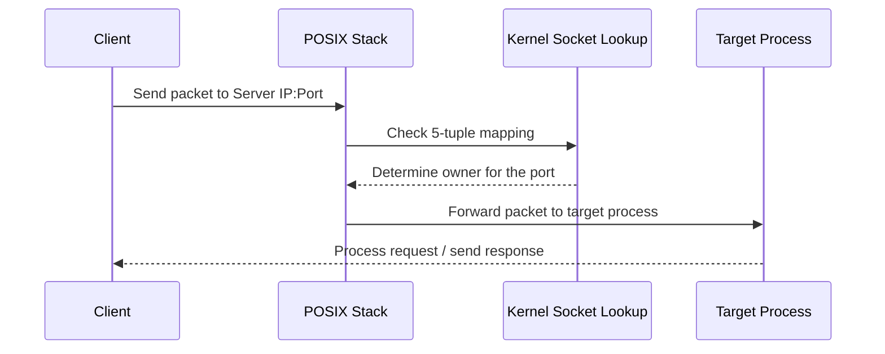
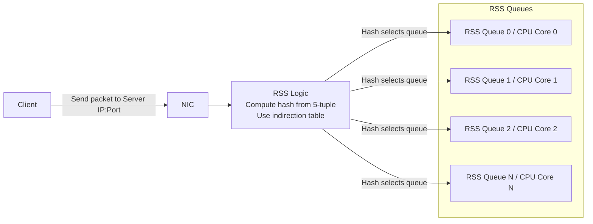

## Client for Shunya KV

Shunya KV needs a smart client to operate at its full potential. Shunya KV exposes a single port for the clients to connect and internally distributes the connections to different shards. A client can choose to not be smart in managing connections and it will work fine but latency and throughput will take a hit.

## **Why ShunyaKV Needs a Smart Client**

ShunyaKV exposes a single TCP port to clients. Internally, each CPU shard (core) listens on its own RSS queue. The NIC performs RSS hashing and distributes incoming packets uniformly across queues.

However:

- RSS hashing is flow-based1
- Key ownership is key-hash-based
- These two hashes are completely independent

The difference between how POSIX stack handles packet and how DPDK stack handles packet is illustrated by the diagrams below.



```
						Packet flow via POSIX Stack
```



```
		                 Packet flow via DPDK stack
```

As a result, RSS provides fairness, not correctness

Let’s assume:

- The DB node has N CPU shards
- RSS distributes traffic uniformly across N shards, so each shard owns ~1/N of the keyspace

For any given key:

- It is owned by exactly 1 shard
- RSS will send the packet to a random shard (uniform distribution)

### **Probability of correct placement**

### $P(\text{Direct Hit}) = \frac{1}{n}$

### $P(\text{Hop}) = \frac{n-1}{n}$

So most requests will land on the wrong shard and require an internal submit_to() (SMP hop).

**What This Looks Like in Practice**

|CPU shard count|P(not landing on owner shard)|% Reroute|
|---|---|---|
|4|0.75|75%|
|8|0.87|87%|
|12|0.91|91%|
|22|0.95|95%|
|48|0.97|97%|

As shard count increases:

- Direct-hit probability decreases
- Cross-core forwarding increases
- Cache locality degrades
- Latency variance increases
- Inter-core traffic increases

At 48 shards, ~98% of requests require a hop. That’s massive !!!

## **The Performance Consequence**

Without a smart client:

- ~90–98% of requests require submit_to()
- Each request incurs:
- Cross-core queueing
- Additional scheduling
- Extra context overhead

This directly increases:

- p99 latency
- tail amplification
- CPU overhead
- cross-shard contention

**What must a client do to fix this?**

To avoid cross-shard forwarding and achieve maximum locality, a ShunyaKV client must implement shard-aware routing.

1. ### **Establish Initial Connection**

2. Connect to the server using the advertised port.

3. Once connected, send: NODE_INFO2
4. The server responds with the key range owned by the shard handling that connection.
5. **Discover All Shards**
6. Continue opening new connections to the same port.
7. For each connection:

    1. Issue NODE_INFO
    2. Record the key range returned
    3. Repeat until connections covering all CPU shards are obtained.

    ⚠️ Important:

8. _Use timeouts for connection attempts._

9. _If some shards are not discovered, continue operating._
10. _Requests sent to the wrong shard will still be honored (with internal forwarding), though at reduced efficiency._
11. **Maintain Shard-Aware Routing**
12. The client should:
    1. Maintain a mapping of key-range → connection pool
    2. Hash the key client-side
    3. Select the correct shard pool
13. Use:
    1. Round-robin
    2. Weighted round-robin
    3. Or custom load strategy
14. Connection pooling per shard is recommended for parallelism.

15. ### **Graceful Degradation**

16. The system continues functioning.

17. Internal forwarding ensures correctness.
18. Only latency and throughput are affected.

## **Summary**

A smart client must:

- Discover shard topology
- Map keys to shard ranges
- Maintain per-shard connection pools
- Route requests deterministically

Client implementation details are intentionally flexible.

---

[^1]: RSS hashing operates at the flow level (IP/port 5-tuple) and cannot align with ShunyaKV’s application-level key ownership hashing.

[^2]: Refer to documentation to understand the various parameters NODE_INFO takes.
