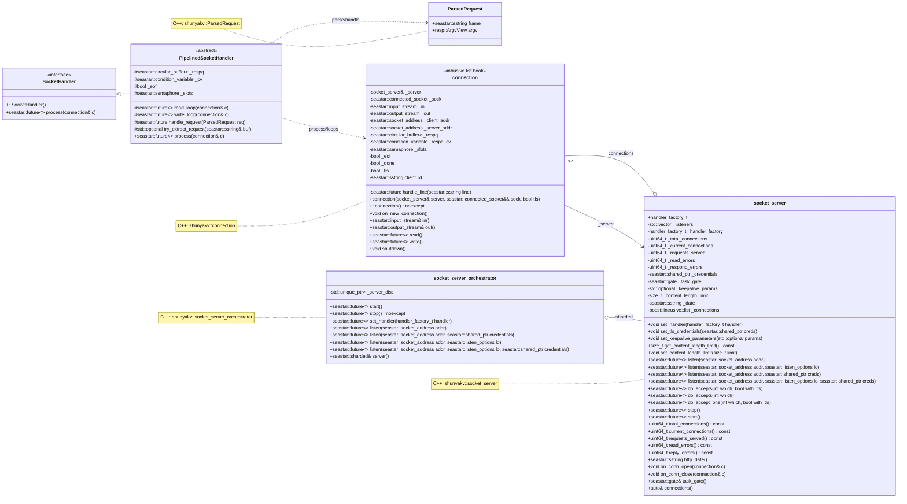

```mermaid
classDiagram
direction LR

class ParsedRequest {
  +seastar::sstring frame
  +resp::ArgvView argv
}

class SocketHandler {
  <<interface>>
  +~SocketHandler()
  +seastar::future<> process(connection& c)
}

class PipelinedSocketHandler {
  <<abstract>>
  #seastar::circular_buffer<seastar::future<seastar::sstring>> _respq
  #seastar::condition_variable _cv
  #bool _eof
  #seastar::semaphore _slots
  #seastar::future<> read_loop(connection& c)
  #seastar::future<> write_loop(connection& c)
  #seastar::future<seastar::sstring> handle_request(ParsedRequest req)
  #std::optional<ParsedRequest> try_extract_request(seastar::sstring& buf)
  +seastar::future<> process(connection& c)
}

class socket_server_orchestrator {
  -std::unique_ptr<seastar::sharded<socket_server>> _server_dist
  +seastar::future<> start()
  +seastar::future<> stop() noexcept
  +seastar::future<> set_handler(handler_factory_t handler)
  +seastar::future<> listen(seastar::socket_address addr)
  +seastar::future<> listen(seastar::socket_address addr, seastar::shared_ptr<seastar::tls::server_credentials> credentials)
  +seastar::future<> listen(seastar::socket_address addr, seastar::listen_options lo)
  +seastar::future<> listen(seastar::socket_address addr, seastar::listen_options lo, seastar::shared_ptr<seastar::tls::server_credentials> credentials)
  +seastar::sharded<socket_server>& server()
}

class socket_server {
  +handler_factory_t
  -std::vector<seastar::server_socket> _listeners
  -handler_factory_t _handler_factory
  -uint64_t _total_connections
  -uint64_t _current_connections
  -uint64_t _requests_served
  -uint64_t _read_errors
  -uint64_t _respond_errors
  -seastar::shared_ptr<seastar::tls::server_credentials> _credentials
  -seastar::gate _task_gate
  -std::optional<seastar::net::keepalive_params> _keepalive_params
  -size_t _content_length_limit
  -seastar::sstring _date
  -boost::intrusive::list<connection> _connections
  +void set_handler(handler_factory_t handler)
  +void set_tls_credentials(seastar::shared_ptr<seastar::tls::server_credentials> creds)
  +void set_keepalive_parameters(std::optional<seastar::net::keepalive_params> params)
  +size_t get_content_length_limit() const
  +void set_content_length_limit(size_t limit)
  +seastar::future<> listen(seastar::socket_address addr)
  +seastar::future<> listen(seastar::socket_address addr, seastar::listen_options lo)
  +seastar::future<> listen(seastar::socket_address addr, seastar::shared_ptr<seastar::tls::server_credentials> creds)
  +seastar::future<> listen(seastar::socket_address addr, seastar::listen_options lo, seastar::shared_ptr<seastar::tls::server_credentials> creds)
  +seastar::future<> do_accepts(int which, bool with_tls)
  +seastar::future<> do_accepts(int which)
  +seastar::future<> do_accept_one(int which, bool with_tls)
  +seastar::future<> stop()
  +seastar::future<> start()
  +uint64_t total_connections() const
  +uint64_t current_connections() const
  +uint64_t requests_served() const
  +uint64_t read_errors() const
  +uint64_t reply_errors() const
  +seastar::sstring http_date()
  +void on_conn_open(connection& c)
  +void on_conn_close(connection& c)
  +seastar::gate& task_gate()
  +auto& connections()
}

class connection {
  <<intrusive list hook>>
  -socket_server& _server
  -seastar::connected_socket _sock
  -seastar::input_stream<char> _in
  -seastar::output_stream<char> _out
  -seastar::socket_address _client_addr
  -seastar::socket_address _server_addr
  -seastar::circular_buffer<seastar::future<seastar::sstring>> _respq
  -seastar::condition_variable _respq_cv
  -seastar::semaphore _slots
  -bool _eof
  -bool _done
  -bool _tls
  -seastar::sstring client_id
  -seastar::future<seastar::sstring> handle_line(seastar::sstring line)
  +connection(socket_server& server, seastar::connected_socket&& sock, bool tls)
  +~connection() noexcept
  +void on_new_connection()
  +seastar::input_stream<char>& in()
  +seastar::output_stream<char>& out()
  +seastar::future<> read()
  +seastar::future<> write()
  +void shutdown()
}

SocketHandler <|-- PipelinedSocketHandler

socket_server_orchestrator o-- socket_server : sharded
socket_server "1" o-- "0..*" connection : connections
connection --> socket_server : _server

PipelinedSocketHandler ..> connection : process/loops
PipelinedSocketHandler ..> ParsedRequest : parse/handle

note for ParsedRequest "C++: shunyakv::ParsedRequest"
note for socket_server_orchestrator "C++: shunyakv::socket_server_orchestrator"
note for socket_server "C++: shunyakv::socket_server"
note for connection "C++: shunyakv::connection"
```
