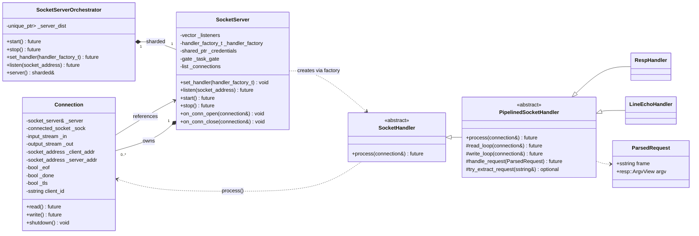

# Conn Class Diagram

```mermaid
classDiagram
direction LR

class Connection {
  -socket_server& _server
  -connected_socket _sock
  -input_stream<char> _in
  -output_stream<char> _out
  -socket_address _client_addr
  -socket_address _server_addr
  -bool _eof
  -bool _done
  -bool _tls
  -sstring client_id
  +read() future<void>
  +write() future<void>
  +shutdown() void
}

class SocketServer {
  -vector<server_socket> _listeners
  -handler_factory_t _handler_factory
  -shared_ptr<tls::server_credentials> _credentials
  -gate _task_gate
  -list<connection> _connections
  +set_handler(handler_factory_t) void
  +listen(socket_address) future<void>
  +start() future<void>
  +stop() future<void>
  +on_conn_open(connection&) void
  +on_conn_close(connection&) void
}

class SocketServerOrchestrator {
  -unique_ptr<sharded<socket_server>> _server_dist
  +start() future<void>
  +stop() future<void>
  +set_handler(handler_factory_t) future<void>
  +listen(socket_address) future<void>
  +server() sharded<socket_server>&
}

class ParsedRequest {
  +sstring frame
  +resp::ArgvView argv
}

class SocketHandler {
  <<abstract>>
  +process(connection&) future<void>
}

class PipelinedSocketHandler {
  <<abstract>>
  +process(connection&) future<void>
  #read_loop(connection&) future<void>
  #write_loop(connection&) future<void>
  #handle_request(ParsedRequest) future<sstring>
  #try_extract_request(sstring&) optional<ParsedRequest>
}

class RespHandler
class LineEchoHandler

SocketHandler <|-- PipelinedSocketHandler
PipelinedSocketHandler <|-- RespHandler
PipelinedSocketHandler <|-- LineEchoHandler

SocketServer "1" *-- "0..*" Connection : owns
Connection --> SocketServer : references
SocketServer ..> SocketHandler : creates via factory
SocketServerOrchestrator "1" *-- "1" SocketServer : sharded
SocketHandler ..> Connection : process()
PipelinedSocketHandler ..> ParsedRequest
```
