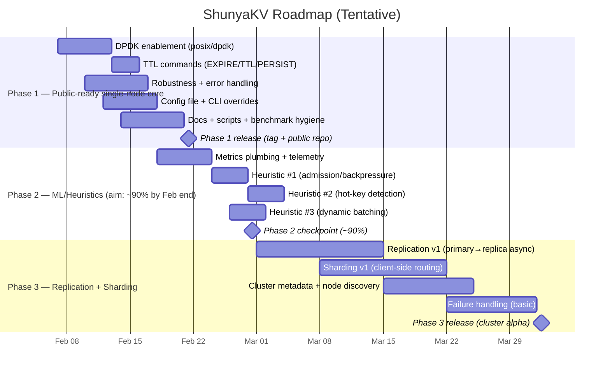
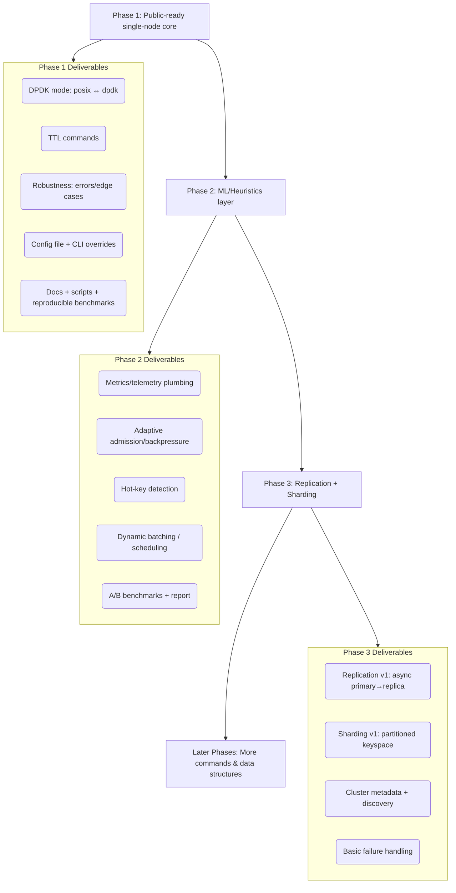

# ShunyaKV Roadmap Timeline

> **Today:** 2026-02-07 (Asia/Kolkata)

This document captures the planned project phases and a timeline view. Dates are approximate and meant to guide execution and reporting.

---

## Phase Summary

- **Phase 1 — Public-ready single-node core**
  - Enable **DPDK** (posix ↔ dpdk mode)
  - Add **TTL** command set
  - Improve **robustness** (errors, edge-cases, safe parsing)
  - Support **config file + CLI overrides**
  - Repo hygiene: docs, scripts, reproducible benchmarks

- **Phase 2 — ML/Heuristic algorithms (adaptive performance)**
  - Metrics plumbing (per-shard inflight/queue depth/latency percentiles)
  - 2–3 heuristics (e.g., adaptive admission control, hot-key detection, dynamic batching)
  - A/B benchmark report for before/after

- **Phase 3 — Replication + Sharding (distributed system)**
  - Replication: primary–replica (async first), basic failure handling
  - Sharding: partitioned keyspace (client-side routing first), cluster topology metadata
  - Commands expansion becomes **secondary** and can move to later phases

---

## Timeline (Gantt)

---

## Execution Flow (Phase progression)

---

## Notes
- **Dates are estimates.** The milestone targets can be moved without changing the phase boundaries.
- The key intention is: **Phase 1 = publishable single-node**, **Phase 2 = adaptive performance**, **Phase 3 = distributed (replication + sharding)**.
